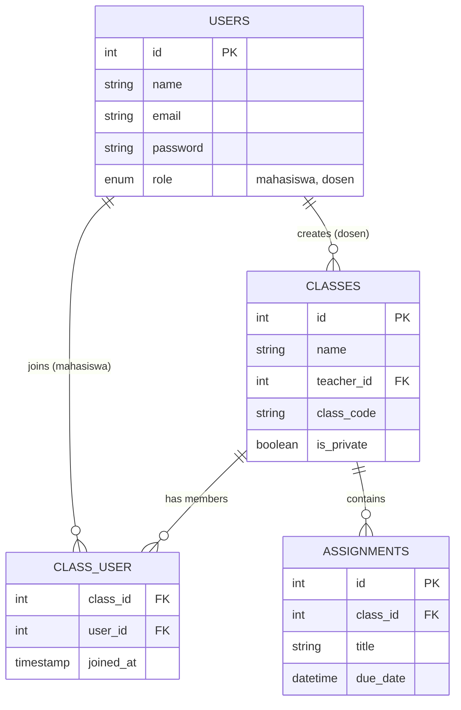

# Product Requirement Document (PRD) - OurClass

## 1. Project Overview
- **Nama Aplikasi:** OurClass
- **Latar Belakang Masalah:** Mahasiswa seringkali kesulitan mengelola informasi tugas karena banyaknya mata kuliah dan grup komunikasi yang berbeda. Informasi tugas di platform chat seperti WhatsApp atau Telegram sering tenggelam, yang menyebabkan mahasiswa lupa tenggat waktu, terlambat mengumpulkan tugas, kehilangan data, dan membuat koordinasi kelas menjadi tidak efisien. Manajemen pembelajaran yang terpecah ini pada akhirnya menyulitkan pengajar (dosen) dan pelajar (mahasiswa) dalam melacak materi dan jadwal secara efektif.
- **Solusi yang Ditawarkan:** OurClass hadir sebagai aplikasi manajemen kelas digital yang menjadi pusat informasi perkuliahan. Fitur utamanya meliputi manajemen daftar mata kuliah, jadwal, tugas dengan tenggat waktu, penyimpanan file soal, kolom diskusi, notifikasi pembaruan, serta pengingat deadline. Sistem ini juga dirancang dengan pengaturan hak akses yang jelas dan pencegahan duplikasi agar data tetap rapi dan aman.
- **Nilai Jual (Value Proposition):** OurClass menarik untuk digunakan karena langsung menyelesaikan masalah utama: informasi tugas yang tidak terorganisir, koordinasi kelas yang tidak efisien, dan risiko lupa batas waktu. Dengan sistem digital yang terpusat, mahasiswa bisa lebih teratur, hemat waktu, dan mudah berkolaborasi.
- **Target Pengguna:** Mahasiswa dan Dosen/Pengajar yang membutuhkan platform manajemen kelas digital yang cepat, responsif, dan terpusat.

## 2. User Personas & User Flow
**Daftar Aktor:**
1. **Guru/Dosen (Pengajar):** Pengguna yang memiliki hak untuk membuat kelas (baik kelas *publik* maupun *privat*), memberikan tugas, dan menyusun agenda.
2. **Siswa/Mahasiswa (Pelajar):** Pengguna yang bergabung ke dalam kelas (secara bebas untuk kelas publik, atau membutuhkan izin/kode khusus untuk kelas privat), melihat materi, mengumpulkan tugas, dan melihat jadwal.

**User Flow (Alur Penggunaan Utama):**
1. **Registrasi/Login:** Pengguna mendaftar dengan memilih peran (Siswa/Mahasiswa atau Guru/Dosen).
2. **Dashboard:** Setelah login, pengguna diarahkan ke Dashboard yang menampilkan ringkasan kelas, tugas terdekat, dan notifikasi.
3. **Manajemen Kelas:** 
   - *Guru/Dosen* dapat menekan tombol "Buat Kelas Baru", mengisi detail, mengatur visibilitas (Publik/Privat), dan membagikan kode kelas.
   - *Siswa/Mahasiswa* dapat mencari kelas publik untuk langsung bergabung, atau menekan tombol "Gabung Kelas" menggunakan kode untuk kelas privat.
4. **Manajemen Tugas & Agenda (CRUD):** 
   - *Guru/Dosen* membuat tugas/jadwal baru di dalam kelas.
   - *Siswa/Mahasiswa* melihat daftar tugas, membaca deskripsi, dan mengumpulkan hasil tugas (Submit).

## 3. Functional Requirements
| ID Fitur | Nama Fitur | Deskripsi Perilaku | Status |
|---|---|---|---|
| F-01 | Autentikasi Pengguna | Pengguna dapat mendaftar (Register), masuk (Login), dan keluar (Logout) dengan aman menggunakan enkripsi password. | Wajib |
| F-02 | Manajemen Profil | Pengguna dapat melihat nama, email, dan peran mereka di aplikasi (Guru/Dosen atau Siswa/Mahasiswa). | Wajib |
| F-03 | CRUD Kelas | Guru/Dosen dapat membuat (Create), melihat (Read), mengubah (Update), dan menghapus (Delete) kelas beserta pengaturan visibilitas (publik/privat). Siswa/Mahasiswa dapat mencari dan bergabung (Read) ke dalam kelas. | Wajib |
| F-04 | CRUD Tugas | Guru/Dosen dapat menambahkan tugas baru, mengubah batas waktu, dan menghapus tugas. Siswa/Mahasiswa dapat melihat daftar tugas dan mengumpulkan hasil tugas (Submit). | Wajib |
| F-05 | Manajemen   Agenda | Menampilkan jadwal kelas atau tenggat waktu tugas dalam tampilan daftar yang mudah dibaca. | Wajib |
| F-06 | Dark/Light Mode | Pengguna dapat mengubah tema tampilan aplikasi dari terang ke gelap sesuai kenyamanan mata. | Wajib |
| F-07 | Multi-Bahasa | Aplikasi mendukung penggunaan dua bahasa, yaitu Bahasa Indonesia dan Bahasa Inggris, yang dapat disesuaikan oleh pengguna. | Opsional |

## 4. Non-Functional Requirements
- **Teknologi (Stack):** 
  - Framework: Laravel 11 (PHP 8.4)
  - Frontend: Blade Templating Engine, HTML5, Vanilla CSS (Custom Design System, Glassmorphism).
  - Database: MySQL 8
  - Ikon: Lucide Icons
- **Keamanan:**
  - Enkripsi password menggunakan `Bcrypt` (bawaan Laravel).
  - Perlindungan *Cross-Site Request Forgery* (CSRF) pada setiap form submission.
  - Validasi input di sisi server (Server-side validation) untuk mencegah SQL Injection & XSS.
  - Memaksa rute HTTPS (*Force Scheme HTTPS*) di lingkungan produksi.
- **Kinerja & Responsivitas:**
  - Desain *Mobile-First*, tampilan aplikasi menyesuaikan secara otomatis dengan baik di perangkat *mobile* maupun *desktop* (Responsive UI).
- **Manajemen Penyimpanan (Storage):**
  - Pembatasan ukuran unggahan file (Maksimal 5MB - 10MB per file) agar *server* tidak terbebani secara berlebihan.
  - Validasi tipe ekstensi file yang diizinkan untuk keamanan (hanya menerima `.pdf`, `.docx`, `.xlsx`, `.zip`, atau `.png`/`.jpg`).

## 5. Database Schema (Rancangan Tabel)

**Entity Relationship Diagram (ERD):**

Berikut adalah penjelasan struktur inti rancangan tabel (*Entity Relationship*):

1. **Tabel `users`**
   - `id` (Primary Key)
   - `name` (String)
   - `email` (String, Unique)
   - `password` (String, Hashed)
   - `role` (Enum: 'mahasiswa', 'dosen')
   - `nim` (String, Nullable)
   - `phone` (String, Nullable)
   - `timestamps`

2. **Tabel `classes` (Kelas)**
   - `id` (Primary Key)
   - `name` (String)
   - `description` (Text)
   - `teacher_id` (Foreign Key -> users.id)
   - `class_code` (String, Unique)
   - `is_private` (Boolean, Default: true)
   - `timestamps`

3. **Tabel `assignments` (Tugas)**
   - `id` (Primary Key)
   - `class_id` (Foreign Key -> classes.id)
   - `title` (String)
   - `description` (Text)
   - `due_date` (DateTime)
   - `timestamps`

4. **Tabel `class_user` (Pivot Table untuk Anggota Kelas)**
   - `class_id` (Foreign Key -> classes.id)
   - `user_id` (Foreign Key -> users.id)
   - `joined_at` (Timestamp)

---
*Catatan: Dokumen ini disusun sebagai pemenuhan syarat Ujian Akhir Semester (UAS) Mata Kuliah Pemrograman Web 2.*
