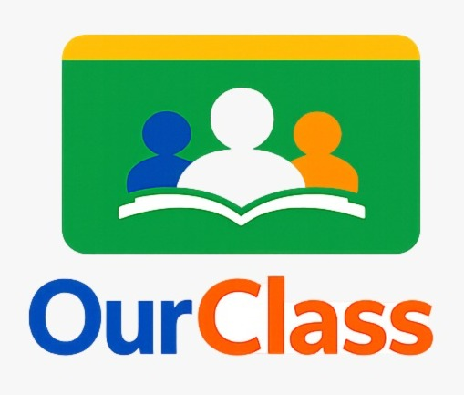

<p align="center">
  
</p>

# OurClass 
## Platform Manajemen Kelas Digital

OurClass adalah aplikasi web kelas digital interaktif yang dirancang untuk membantu siswa/mahasiswa dan guru/dosen dalam mengelola administrasi kelas, melacak tugas, mengelola jadwal, serta menyediakan laporan otomatis secara efisien dan terintegrasi.

Aplikasi ini sudah dideploy secara live dan dapat diakses di:
 **[ourclass-production.up.railway.app](https://ourclass-production.up.railway.app)**

---

## 1. Fitur Utama

1. **Autentikasi & Multi-Role**: Sistem pendaftaran dan masuk (Login/Register) terpisah untuk peran **Guru/Dosen (Pengajar)** dan **Siswa/Mahasiswa (Pelajar)**.
2. **Dashboard Interaktif**: Halaman utama yang menampilkan ringkasan kelas, jadwal terdekat, tugas aktif, dan notifikasi terbaru.
3. **Manajemen Kelas**:
   - Guru/Dosen dapat membuat kelas baru dan membagikan kode kelas unik.
   - Siswa/Mahasiswa dapat bergabung dengan memasukkan kode unik kelas.
4. **Manajemen Tugas (CRUD)**: 
   - Guru/Dosen dapat mengunggah tugas dengan tenggat waktu.
   - Siswa/Mahasiswa dapat melihat daftar tugas dan tenggat waktunya.
5. **Manajemen Agenda**: Menampilkan jadwal kuliah, pertemuan kelas, atau batas waktu tugas dalam format daftar terstruktur.
6. **Kustomisasi Tema**: Mendukung *Dark Mode* dan *Light Mode* yang cepat dan responsif.
7. **Responsif & Mobile-Ready**: Antarmuka dioptimalkan agar ramah digunakan di browser smartphone (HP) maupun layar desktop/laptop.
8. **Bahasa**: Bisa memilih untuk menggunakan bahasa Indonesia atau Bahasa Inggris
9. 

---

## 2. Teknologi yang Digunakan (Tech Stack)

- **Backend**: PHP 8.4 (Framework Laravel 11)
- **Frontend**: Blade Templating Engine, HTML5, Vanilla CSS (Custom Design System, Glassmorphism), JavaScript
- **Database**: MySQL 8
- **Pustaka Ikon**: Lucide Icons
- **Deployment Platform**: Railway

---

## 3. Struktur Database Utama

1. **`users`**: Menyimpan data akun pengguna (nama, email, password terenkripsi Bcrypt, peran/role, nomor WhatsApp, NIM/NIP).
2. **`classes`**: Menyimpan data kelas yang dibuat oleh Dosen (nama kelas, deskripsi, kode kelas unik, ID pembuat).
3. **`assignments`**: Menyimpan data tugas yang ditambahkan di setiap kelas (judul tugas, deskripsi, batas waktu/due date).
4. **`class_user`**: Tabel pivot relasi many-to-many untuk mencatat mahasiswa yang bergabung ke dalam kelas.

---

## 4. Pengembangan Lokal (Local Development)

Jika ingin menjalankan proyek ini secara lokal menggunakan Laragon atau PHP Development Server:

1. **Clone Repositori**:
   ```bash
   git clone https://github.com/NadNad-z/OurClass.git
   cd OurClass
   ```

2. **Instal Dependensi**:
   ```bash
   composer install
   ```

3. **Atur Environment**:
   Salin `.env.example` menjadi `.env` lalu sesuaikan kredensial databasemu:
   ```bash
   cp .env.example .env
   ```

4. **Generate Key & Migrasi Database**:
   ```bash
   php artisan key:generate
   php artisan migrate --seed
   ```

5. **Jalankan Aplikasi**:
   ```bash
   php artisan serve
   ```
   Buka `http://127.0.0.1:8000` di browsermu.

---
*Proyek ini diajukan untuk memenuhi Ujian Akhir Semester (UAS) mata kuliah Pemrograman Web 2.*
